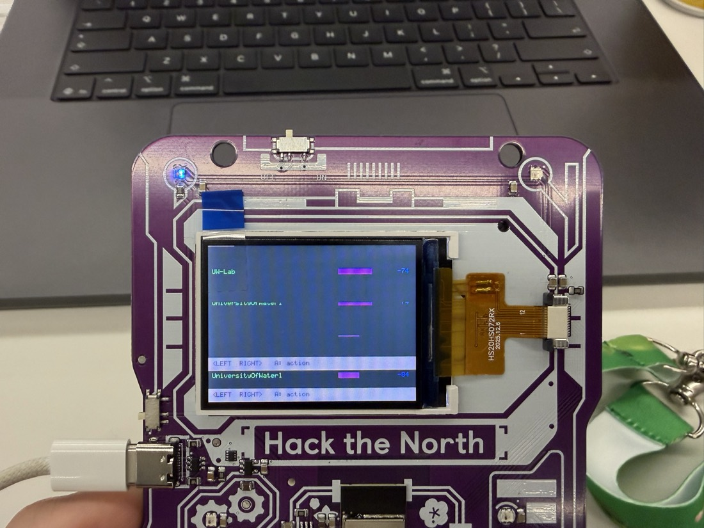
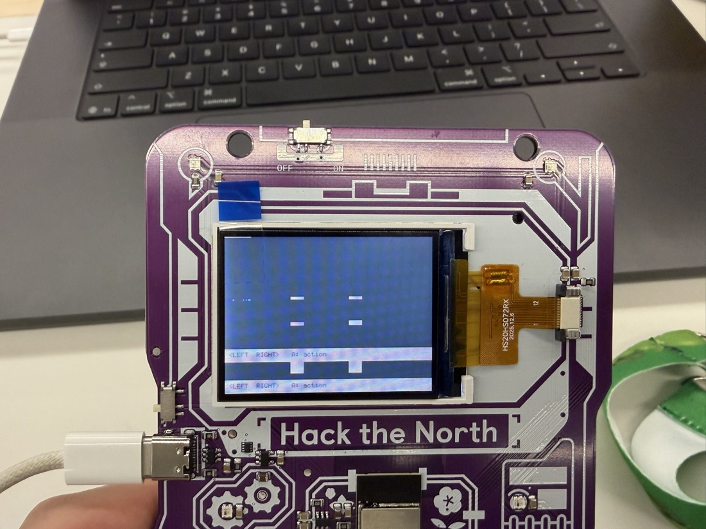

# Firmware notes — things that cost us time

Working notes from bringing up custom firmware on the ESP32-C3 badge. All of
these were found the hard way.

## Toolchain

Four traps, none of them in the official guide:

1. **`export.sh` does not put the compiler on PATH** in a non-interactive
   shell. It prints "Done! You can now compile ESP-IDF projects" and exits 0,
   but `which riscv32-esp-elf-gcc` still fails. Add
   `~/.espressif/tools/riscv32-esp-elf/*/riscv32-esp-elf/bin` manually.
2. **`install.sh esp32c3` does not install cmake or ninja.** `brew install
   cmake ninja` — cmake 4.4.3 works fine with IDF v5.5.3.
3. **A failed configure poisons `build/`.** After fixing PATH the build still
   claimed the compiler was missing, because `CMakeCache.txt` had cached the
   old environment. `rm -rf build sdkconfig` and re-run `set-target`.
4. **IDF builds with `-Werror`.** Two `if` statements on one line fails
   `-Werror=misleading-indentation`. This will bite repeatedly.

Component APIs also drift by version — check the header in
`managed_components/` rather than trusting a doc example. `led_strip` uses
`.led_pixel_format` in some versions and `.color_component_format` in others.

## Reset handling

| Goal | What works |
|---|---|
| Download mode, stock firmware running | **Physical only** — hold Start while plugging in USB |
| Download mode, custom firmware running | `esptool --before usb-reset` |
| Boot the app after flashing | **`esptool --after watchdog-reset`** |

`--after hard-reset` prints `Hard resetting via RTS pin...`, exits 0, and does
nothing — RTS is not wired to EN on this board. The badge is left silent in
the bootloader, which looks exactly like a failed flash. This one is worth
remembering.

Together, `--before usb-reset` + `--after watchdog-reset` give a fully
software-driven edit/build/flash/run loop once custom firmware is on the badge.
Only the very first entry into download mode needs hands.

## ST7789 display

Two traps that produce output looking like a hardware fault but are pure
software:



**RGB565 byte order.** The panel takes each pixel MSB-first, so a
little-endian `uint16_t` goes out byte-reversed. The giveaway: near-white
renders *cyan*. Pre-swap at colour construction:

```c
#define RGB(r,g,b) ((uint16_t)__builtin_bswap16(\
    (uint16_t)((((r)&0xF8)<<8)|(((g)&0xFC)<<3)|((b)>>3))))
```



**`esp_lcd_panel_draw_bitmap` is asynchronous.** It queues the DMA transfer and
returns before the hardware reads your buffer. With a single shared stripe
buffer, a pending transfer paints whatever the *next* stripe already wrote —
on screen, bands render at the wrong height and content appears twice. Register
`on_color_trans_done` and block on a semaphore before touching the buffer:

```c
esp_lcd_panel_io_callbacks_t cbs = { .on_color_trans_done = on_blit_done };
esp_lcd_panel_io_register_event_callbacks(io, &cbs, NULL);
// after every draw_bitmap:
xSemaphoreTake(blit_done, pdMS_TO_TICKS(200));
```

The callback runs in ISR context: `IRAM_ATTR` and `xSemaphoreGiveFromISR`.

**Rendering without LVGL.** A full 320x240x2 framebuffer is 150 KB, which does
not sit comfortably beside the WiFi driver on a 400 KB part. We use one
320x48 DMA buffer (30 KB) reused five times per frame, with draw calls clipped
to the active stripe, and a 5x7 bitmap font. Avoids a dependency whose API had
already shifted under us once.

## Accelerometer axis is mirrored

The panel init includes `esp_lcd_panel_mirror(true, false)`, which mirrors X.
The accelerometer is not mirrored, so **sensor +X is screen −X** — tilt right
and the dot goes left. Keep raw values raw and convert at the point of use.
Y needs no flip.

Front-face LED order is **0 UpperLeft, 1 UpperRight, 2 MiddleRight,
3 BottomRight, 4 BottomLeft, 5 MiddleLeft** — so a pure "right" cue is index
**2**, not 3.

## USB-Serial-JTAG console

**`printf` blocks when the buffer fills and no host is draining it.** On USB
this never shows up because the host reads continuously; on battery the main
loop freezes solid and the display stops updating. It looks like a crash.

Do not try to reduce log volume — move all logging to a **separate
low-priority FreeRTOS task**. If it stalls, the UI, radio and buttons carry on.

Also: **the first ~1.6 s of boot output is always lost**, because the CDC
endpoint only enumerates after reset. Anything printed once at startup never
reaches the terminal. Print status on a loop, or stash it in a global and
report it later.

## Floating point is catastrophic

The ESP32-C3 has **no FPU**. A soft-float multiply-add costs ~240 cycles and
`expf` ~3400. In any hot loop, budget in integer ops and treat every
`expf`/`logf` as a ~3400-cycle event. Converting one inner loop from float to
fixed-point integer arithmetic gained close to 10x on a numeric workload.

## Flashing does not erase badge data

Keep the partition table byte-identical to stock and the flash writes only
`0x0`, `0x8000` and `0x10000`. `nvs` at `0x9000` and the LittleFS `storage`
partition are never touched, so provisioning and saved state survive. Verified
by reading the flash back and diffing the storage partition byte-for-byte.

What *does* destroy data is `erase_flash`, or a partition table that relocates
`storage` — a default Arduino/OTA layout will do exactly that. Read the real
table out of a flash dump rather than inferring it.

One caveat: any firmware that brings up WiFi writes RF calibration data to
`nvs`, so a backup taken afterwards differs from one taken before. Provisioning
survives either way.

## ESP-NOW between two badges: three traps

Getting a reliable badge-to-badge link took far longer than the application
code on top of it. Three separate causes, each of which silently produced
"transmitted fine, never arrived".

**1. A background scan destroys the link.** A WiFi scan sweeps all 13 channels
and takes ~2 s. ESP-NOW only works while both ends sit on the *same* channel,
so any periodic scan — even one added purely for debugging — makes a badge
deaf for a large fraction of its life. Symptom: one direction works and the
other does not, depending on which badge happens to be scanning. Scan only on
explicit user action, and call `esp_wifi_set_channel()` on the way out.

**2. Broadcast is only RECEIVED with promiscuous mode enabled.** With
promiscuous off, `esp_now_send()` to `ff:ff:ff:ff:ff:ff` returned `ESP_OK`
every time and nothing was ever received — same channel, both directions,
verified with counters on both ends. Turning promiscuous mode on at boot fixed
it instantly. Worth knowing because the failure gives no error at any layer.

**3. Broadcast TX status is meaningless.** `ESP_NOW_SEND_SUCCESS` for a
broadcast means the frame was transmitted, not that anything heard it — there
is no acknowledgement for broadcast. So the send callback cannot tell you
whether the link works. **Register the peer's actual MAC and unicast**: that
is acknowledged at the MAC layer, so the status callback becomes a real
delivery signal.

### Debug it by measuring, not reasoning

The channel was theorised about and "fixed" three times before anyone printed
`esp_wifi_get_channel()`. The actual value found the bug in one reading:

```
badge A:  ch=1   apch=1      <- pinned
badge B:  ch=5   apch=1      <- mid-scan, deaf
```

The other thing that paid for itself immediately was a counter on each message
type at both ends:

```
NOW req_tx=5(rc0) req_rx=0 resp_tx=0 resp_rx=0 peerAP=0
```

That single line localises the break — sent-but-not-arrived, arrived-but-not-
answered, or send failing outright — without any guessing. Add it before the
first fix attempt, not after the third.


## The walk counter was never wired to the step detector

Stage 1 asks the user to walk a baseline, and the solver needs its length. The
accelerometer step detector existed and worked, but `step_detected()` only
incremented a global `steps` left over from an earlier compass feature —
`tri_steps` and `tri_walk` were reset on entry to stage 1 and never
incremented.

The failure was silent, which is what made it expensive. The screen sat at
"0 steps / 0.0 m" no matter how far you walked, and the capture path quietly
fell back to an assumed 3 m baseline, so the solved bearing was computed
against a made-up distance rather than failing outright.

Fixed by incrementing `tri_steps` / `tri_walk` from `step_detected()` whenever
`tri_stage == 1`. Step length is 0.72 m; the detector uses a smoothed |a| with
1150/1050 mg hysteresis and an 8-tick (160 ms) refractory period.

## A blocking scan should freeze the frame, not wipe it

`do_scan()` blocks for about 2 s and used to paint "scanning..." over the whole
screen first, on the theory that a wipe looks less broken than a freeze. On a
page showing a map it is the other way round — a still frame reads as "busy",
a wipe reads as "crashed".

A `scan_silent` flag now leaves the last frame up. It is set around the capture
scan and around the scan a badge runs when *answering* a peer's request. The
second case matters more: that scan is triggered by the **other** badge, so
whoever is holding this one sees their screen blank for two seconds with no
input of their own.

## The slow part was not the scan

A capture felt slow, and the obvious suspect was the 13-channel scan (~2 s).
The actual cost was `FTM_BURST = 20` — twenty ranging sessions at up to 500 ms
each. Measuring before optimising would have found this immediately; reasoning
about it pointed at the wrong thing.
