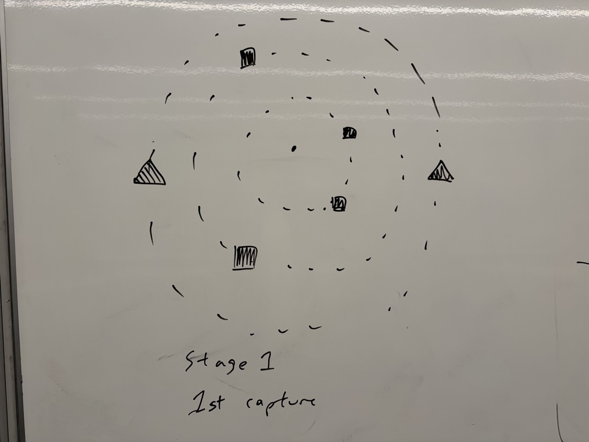
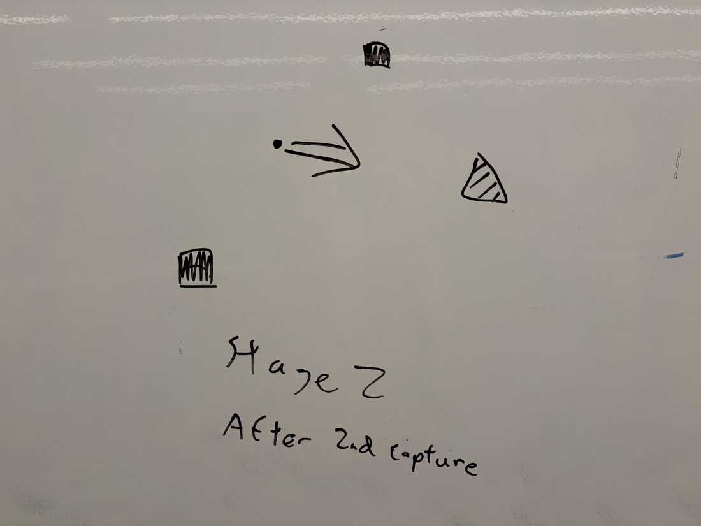
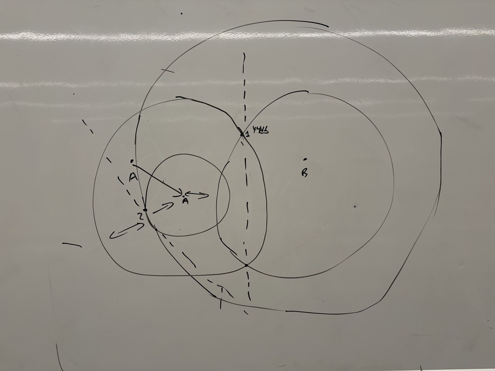
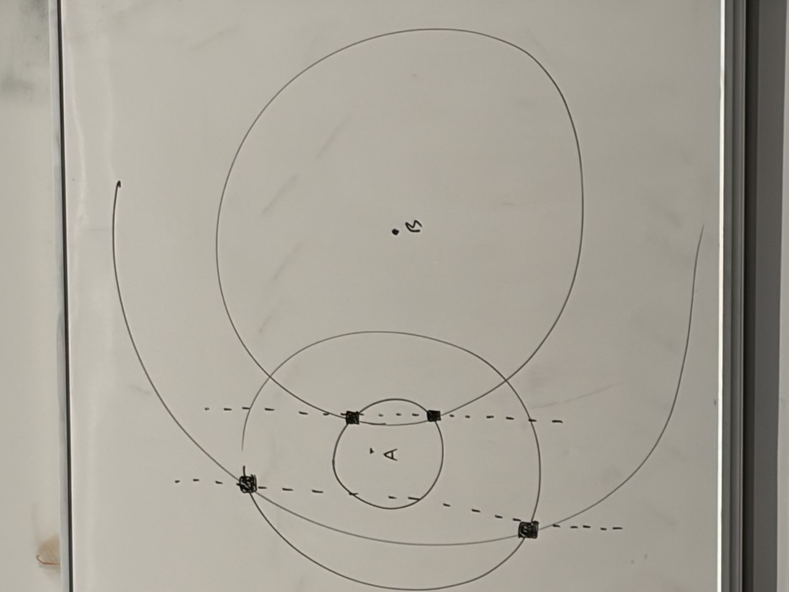

# AP-triangulation finder — design

Two-stage method for getting a **direction to walk**, not just a distance,
using the building's WiFi access points as shared reference points.

Origin: team ideation session, whiteboard diagrams IMG_7303–7306.

---

## Why

The current finder measures **distance** well (FTM, ~1–5 m) and gives only a
weak **bearing** (body-shadow spin, ±29° single spin). Knowing you are 8 m from
your teammate without knowing which way to walk is not useful enough.

Key insight from the team: **we are not alone in the room.** There are 5–8
access points visible, they are static, and *both* badges can see them. They
are free reference points.

---

## The method

### Stage 1 — first capture

1. A picks B as the target and sends B a "locate me" request (ESP-NOW).
2. **A scans**: RSSI of every visible AP, plus range to B (FTM).
3. **B scans** the same way and sends its AP list back to A.
4. A keeps only the **AP subset visible to both**.
5. For each common AP *i*:
   - `dA_i` = distance A→AP from RSSI path loss
   - `dB_i` = distance B→AP from RSSI path loss
   - Circle of radius `dA_i` about A, circle of radius `dB_i` about B
   - They intersect at **two candidate positions** for that AP

After stage 1 every AP has two possible locations, mirrored across the line AB,
and B itself has two possible bearings.

### Stage 2 — second capture

6. Prompt the user to **walk a few steps in any direction**. Step count gives
   the displacement magnitude; the direction is "straight ahead" in the user's
   own body frame.
7. **A re-scans** from the new position A₂.
8. Three anchors now exist — A₁, B, A₂ — which resolves the mirror ambiguity
   and fixes each AP's true position.
9. The reconstructed map is now **anchored to the direction the user walked**,
   so the bearing to B can be expressed as an angle relative to their heading.

---

## Geometry check: the parallel-chords hypothesis

**Team hypothesis:** the lines joining each AP's two candidate positions are
all parallel, and the direction to travel is perpendicular to them.

**Verified — both parts are true.** Two circles centred at A and B intersect
at two points that are reflections of each other across the line AB, so the
chord joining them is perpendicular to AB. That holds for every AP, so all
chords are parallel to each other and perpendicular to the A→B direction.
Checked numerically against six random AP positions with a non-axis-aligned
AB: every chord came out at exactly 90.00° to AB.

**But there is a catch, and it matters.**

To draw those circles you must place A and B in some coordinate frame. We know
`|AB|` from FTM but *not* the bearing, so in practice you put A at the origin
and B at `(|AB|, 0)`. In that frame the chords are perpendicular to the x-axis
**by construction**. The relationship is real, but in the only frame we can
actually build it is tautological — it recovers the axis we ourselves chose,
not a real-world direction.

So stage 1 alone cannot tell you which way to walk. It reconstructs the
*relative* geometry of {A, B, APs} correctly, but that shape is free to rotate
and reflect: without a compass there is nothing tying it to the room.

**Stage 2 is what actually supplies the missing information.** Walking gives a
displacement whose direction the user can feel. Re-measuring from A₂ both
kills the reflection ambiguity and pins the reconstructed map to the walk
direction. That is what converts the shape into an instruction.

---

## Honest assessment

**What this adds over the closing-rate method already implemented:**
the same fundamental principle (walk, re-measure, solve), but with 5–8 extra
constraints per capture instead of one. An over-determined system is far more
robust to any single bad measurement, and multipath errors on different APs are
largely independent, so they partially average out. That is a real improvement,
not a different capability.

**The strongest reason to do it, which came out of the diagrams:**
**APs are static.** Once their positions are solved they can be cached. A later
localisation becomes a single scan matched against a known map — no walking, no
spinning, instant. That is the standard indoor-positioning approach and it is
the natural end state of this design.

**Main risks**

| Risk | Detail |
|---|---|
| RSSI→distance is poor | Factor-of-two typical. The rings are thick annuli, not thin circles. Errors here dominate. |
| Geometric dilution | If the common APs are nearly collinear with AB, the intersections are ill-conditioned and the solution is unstable. Prefer APs spread in bearing. |
| Needs a data channel | B must return its scan. ESP-NOW carries 250 B; 8 APs × (6 B BSSID + 1 B RSSI) = 56 B. Comfortable. |
| Step length | 0.72 m assumed. Errors scale the whole map, though not the bearing. |
| Walk direction must be straight | A curved walk breaks the displacement assumption. |

**Expected accuracy:** better than the current ±29° single spin, because the
system is over-determined — but bounded by RSSI distance error, so probably
±15–25° rather than a precise arrow. Worth measuring rather than predicting.

---

## UI

**Stage 1 screen** (per IMG_7304): user is the dot at centre; dashed concentric
rings are the RSSI-derived distances to each AP; black squares mark AP
candidate positions; two triangles show the two mirrored candidate bearings for
B. Prompt: *"walk a few steps"*.

**Stage 2 screen** (per IMG_7303): ambiguity resolved. Rings collapse to single
AP positions, one triangle remains, and a single arrow points the way.

**After stage 2:** a live compass. As the user turns, the map rotates with them
and the arrow keeps pointing at B.

> Note the live-compass step still needs a heading source. With no gyro or
> magnetometer, rotation cannot be tracked directly — so this has to be
> maintained the same way as the current implementation, by continuing to
> re-measure while walking, not by dead-reckoning the turn.

---

## Open questions

1. How bad is RSSI→distance for the APs in practice? Measure before building.
2. Does per-AP path-loss calibration help, given each AP has unknown TX power?
3. Best AP subset: strongest N, or the spread that minimises dilution?
4. Can the AP map be cached across sessions, turning this into one-scan
   localisation?
